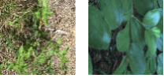

# Artificial Neural Networks & Deep Learning Challenges
This repository is intended for the challenges of the Artificial Neural Networks and Deep Learning at PoliMi.

## Team members
Lexicographic order by surname:
* Nicola Dean n. __
* Marco Fasanella n. __
* Raffaello Fornasiere n. __
* Christian Spano n. 10823764

Team Name: **4guys1neuron**

# First Homework
We are required to classify species of plants (like the ones in the example image below), which are divided into categories according to the species of the plant to which they belong. Being a classification problem, given an image, the goal is to predict the correct class label.

  

Further details can be found here: https://www.kaggle.com/c/artificial-neural-networks-and-deep-learning-2020/overview

## First Homework Evaluation
The metric used to evaluate models and place the Teams in Leadeboard is the Total Accuracy. The score is computed as

  $\frac{1}{N}\sum_{1\leq i \leq N} \text{predictions}_i == \text{targets}_i$

where $N$ is the total number of images in the test set (never seen).
